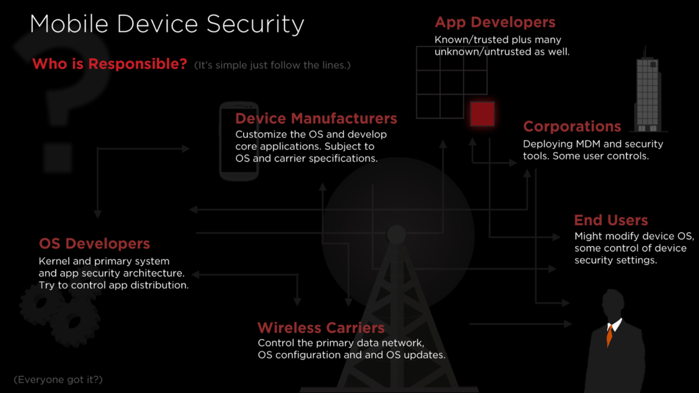

# Who is responsible for securing mobile devices?

Mobile devices are a complicated technology and many different parties are involved in securing, or not securing, the mobile device.

## Why other people have more access to device than you do

Interestingly in the mobile device model, there are a host of parties that have far greater access to *your* mobile device that you do. For example:

* OS manufacturers and the OS and apps they write
* OEM for the modifications they make to the OS and the apps they write
* Wireless carriers, for the modifications they make, apps they write/install (both theirs and 3rd parties)
* Wireless carries, baseband and other setting

# Involved parties

