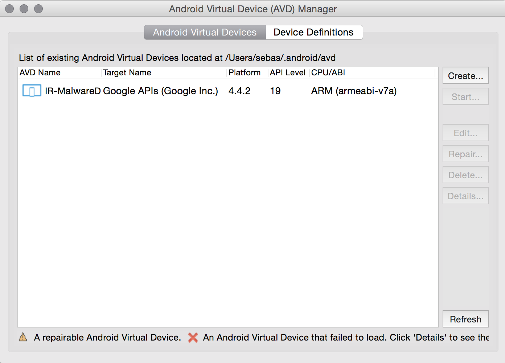
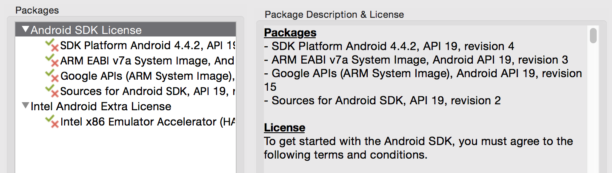
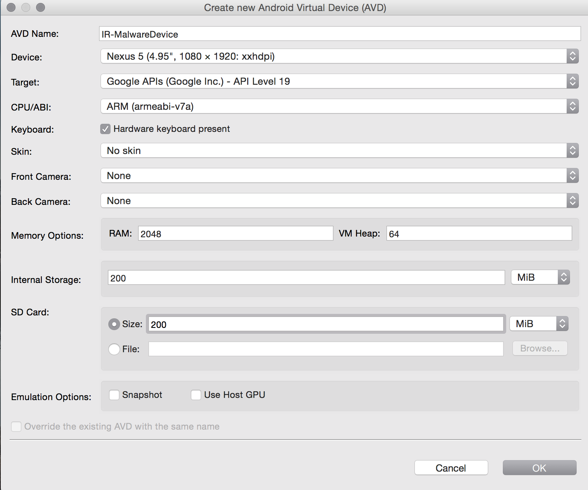
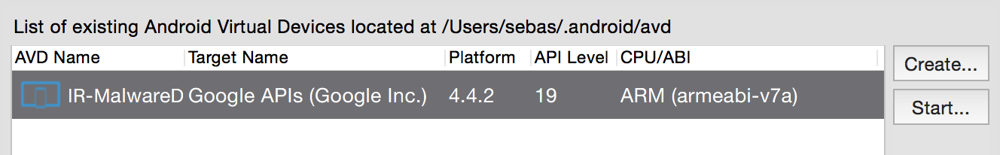

# Android Malware Analysis

The section will provide a high level process for analyzing Android malware and examples will leverage the NowSecure Platform.

# Identifying known malware
**Note** *These bullet points are merely informative* 

## YARA, * Using Yara rules
	* Explain how it works
	* Show some cases
	* Create a new rule for a known malware

* Androguard malware database
	* Explain how it works
	* Show few cases
	* Create a new rule for a known malware

# First encounter - Creating a safe environment
The most important step before analyzing a piece of malware, is to setup a controlled environment where the sample can be triggered and its behavior analyzed.

If the setup is done correctly, it will help the analyst to obtain a strong knowledge of the functionalities and behavior implemented within the malware. However, in order to obtain a complete understanding of the malware's logic, a static and dynamic analysis are required. This is the real path to analyze and disassembly a piece of malware.

The purpose of this section, is to describe in details how to configure and prepare a laboratory for analyzing different types of malware, no previous experience is required, as our intention is to keep it as simple and minimalistic as possible.

*[Keep adding introductory paragrpahs]*

## Setting up the emulator
### Introduction
Nowadays, the growth that Android has suffered is considerable, and the alternatives out there in the market to setup an emulator are numerous. Like everything else, each one has their advantages and disadvantages, being the user the one who has to decide which one fills his needs.

Obviously, not all of them offer the same functionalities, and their use is focalized to different purposes that might not be in line with actual needs. The list is in continous expansion, however we attempted to narrow it to the most significant ones:

#### Android SDK / AVD
The Android SDK includes a device emulator that runs on the computer.  The Android emulator mimics all the hardware and software features of a traditional and real mobile device, except that it is not capable of perform phone calls, or make a proper use of NFC capabilities (*Are we sure of this?*)

*[Insert screenshot]*

The emulator makes use of Android Virtual Device (AVD) configurations, that let the user defines specific hardware aspects, and allow to create multiple configurations to test numerous Android platforms and hardware combinations.

It runs a full Android system stack, from user to kernel level. There are multiple Android system images available through the Android SDK Manager, which contain code for the Android Linux Kernel, the Dalvik VM, the native libraries, and various Android packages. Moreover, the emulator provides dynamic binary translation of device machine code to the operating system, and processor architecture of the development machine.

**Advantages**

* Full Android system stack
* Flexible, multiple configurations

**Disadvantages**

* No phone calls
* No NFC capabilities

*This is just an example, no needs to be here necessarily, maybe using a table?*

#### Android-x86
Is an unofficial initiative which aims to port Google's Android Mobile operating system to run on devices configured by AMD and Intel x86 processors. The OS is based on the Android Open Source Project, with minor modifications necessary to run it on PC architecture.

There are minor low-level components replaced to obtain a better performance, such as the kernel (*it runs on the long-term Linux Kernel available*), and Bionic library (*some components are replaced with others from GCC*).

**Note** *Drop few more paragraphs on Android-x86*

**Advantages**
* Android system can runs on a PC architecture.

**Disadvantages**
* Most dynamic utilities don't work on a PC architecture.

### Using the emulator
Different alternatives to emulate an Android device have been commented few sections above, however, the needs that are going to be covered in this section require to emulate an Android device using the official Android SDK/AVD.

An Android Virtual Device (AVD) is basically an emulator configuration that lets the analyst to recreate an actual device by specifying hardware and software options that will be emulated by the Android Emulator.

There are plenty ways to create an AVD, but the easiest one is to use the graphical AVD Manager, which can be located in Android Studio by clicking *Tools > Android > AVD Manager*

The four fundamental pillars that compose an AVD emulator are:

* **Hardware profile** - Contains the hardware characteristics of the virtual device. Is the place where you define how much memory it has, SD card storage, and so on.

* **Storage area on the computer** - Used as device's user data and SD Card. Applications will be installed in this area.

* **System image** - Defines the version of Android that will run on the Android emulator.

* **Miscellaneous** - Options like the SD card that is going to be used by the virtual device, or its skin, where other parameters like screen dimension, keys, appearance, etc. can be controlled.

### Creating an AVD with AVD Manager
The AVD Manager can be launched either:

* In Android Studio, by clicking *Tools > Android > AVD Manager*.
* Using the command line and navigate to the SDK's *tools/* directory and execute: ``$ android avd``

To effectively deploy our tools and conduct the tests, the AVD created should be running latests version of Android, and have enough memory and space to run the applications without interruptions nor malfunctions.

Before creating the virtual device, lets going to check if all the dependencies and libraries are satisfied for the specific API. For that purpose, open the Android SDK Manager, and make sure to install Android.4.4.2 (API 19).

Right after solving all the dependencies, it is time to create our first AVD:

1. From the main screen (Figure 1), click **Create...** button.
2. Select a proper device configuration, such as Nexus 5 in this case, then click  **Ok**

3.  A new item should appear in the list of AVDs, select the one created recently and press the **Start** button.

### Creating an AVD from command line
*Are we interested on explaining something like this?*

* How to analyze a malware with the emulator

## Using a real device
* Introduction
* Main advantages and disadvantages
* Which is the best device?
* Configuring the device
* How to analyze a malware with the device

# Exploring your toolset and techniques
This section presents the tools that might be useful when inspecting or altering the behavior of an application for which source code is not available, and some other utilities, really useful, when doing static analysis of Android applications.

## Static Analysis Tools
### Androguard
Androguard is a well known open source reverse-engineering and analysis framework deployed in Python. It inclues multiple functionalities that help to make easier the analysis of an application or malware sample. As it can disassemble, decompile and modify DEX and ODEX files, parse and format its structure into readable python objects and expand the framework with new functionalities thanks to its modularity.

It provides access an analysis on objects like instructions, classes, methods, permissions, etc. For more detailed information, consult  ``https://code.google.com/p/androguard/``.

### Smali and Baksmali
Smail is an assembler for the Dalvik executable (DEX) format. Baksmali is a disassembler that translates the binary into dalvik bytecode. It supports the full functionality of the dex format, including annotations, debug info, etc. It is based on Jasmin's/dedexe's syntax. For more information, please refer to ``https://code.google.com/p/smali``.

### apktool
Its an open source java tool for reverse-engineering purposes. It can decode APK files into its original resources decoded in human readable XML, and produce disassembly code for all the classes and methods that compose the APK.

Once the application has been decoded, it is possible to modify its source code to alter the behavior or include a new functionality. Right after deploying your changes, it is possible to rebuild the application again with ``apktool``  and test the changes introduced.

More information can be found at: ``https://code.google.com/p/android-apktool/``.

### dex2jar
Is a toolset to work with Android .dex and Java .class files. However, its main use is to convert Android's .dex format to Java's .class format,, ready to be analyzed with third parties utilities.

For more advanced users, they can give a try to these utilities:

* **dex-reader/writer** Read/Write the Dalvik Executable file.
*  **d2j-dex2jar** Convert .dex file to .class files.
*  **smali/baksmali** Disassemble dex to smali files and assemble dex from smali files
*  **d2j-decrypt-string** Utility constructed to defeat a specific strings encryption mechanism.

For more information, please refer to: ``https://code.google.com/p/dex2jar/``.

### jad
JAD is a closed source and unmaintained decompiler for Java, which provides a command-line interface that helps to produce readable Java code, or at least an approximation, from CLASS files. It is commonly used with ``dex2jar`` and ``JD-Gui``.

For more information, please go to: ``http://varaneckas.com/jad/``.

### JD-GUI
A closed source decompiled capable of reconstruct Java source code from CLASS files. It comes with a graphical user interface that makes easier the analysis process, furthermore, it can be used in addition with ``jad`` and other utilities described in this section.

Depending on the application and its source code, the output provided by this utility will be more reliable than others.

For more information, please refer to: ``http://jd.benow.ca/#jd-gui``.

### JEB
JEB is a commercial Dalvik bytecode decompiler on its second version that produces a very nice approximation to Java readable code from Android's APK or DEX files. Among its features, a notorious mention goes to its interactive decompiler that allows the researcher to analyze the cross-references across methods, classes, data, strings, etc.

Besides that, it is also possible to rename methods, fields, classes, etc and reconstruct applications obfuscated with ProGuard or Dexguard, to mention a few of them.

Another important aspect, is the interactive shell included within the software, that allows to expand its functionalities by programming scripts written in Python.

For further information, please refer to: ``URL``.

### Radare2
Radare2 is an open source, portable reverse-engineering framework used to manipulate binary files. Includes a debugger, a stream analyzer, assembler, disassembler, code analysis modules, a binary diffing tool, among others.

Although Radare2 is a multipurpose tool, it is really useful for disassembling Dalvik bytecode or analyze propietary binary blobs when dealing with Android reverse engineering.

For more information, please visit: ``www.radare.org/``.

### IDA Pro and Hex-Rays Decompiler
The heavy weight in terms of reverse engineering utilities. The Interactive Disassembler is a propietary disassembler and debugger able to handle a huge variety of propietary binaries and processor types.

In addition to this, it is important to highlight the Hex-Rays Decompiler, which is an IDA Pro plu-gin that helps to convert the disassembled output of ARM and x86 executables into human readable pseudo-code.

More information can be found at: ``https://hex-rays.com``.

### Hopper
A more accessible and user friendly disassembler that lets the user to decompile and debug 32/64bits Intel Mac, Linux, Windows and iOS executables. Among its main features, is important to highlight the ability to extend its functionalities through the Hopper SDK , and even write a specific file format and CPU support, or  provide a set of functionalities via Python scripts, transforming a binary in any way you want.

For more information, please refer to its official website: ``www.hopperapp.com``.

## Hooking and Instrumentation Tools 
### Cydia Substrate
This well known framework enables the ability to make changes to existing software through Substrate plugins or extensions that are injected into the application's process. Substrate is pretty similar to XPosed Framework, except its source code is closed, and its *modus operandi*, as it does not modify any system's component.

Furthermore, it provides the ability to hook native code as well as Dalvik methods.

For more information please refer to ``www.cydiasubstrate.com``.

### XPosed Framework
Similar to Substrate, XPosed also allows to modify the application's behavior at runtime, without being necessary to recompile the original application. In contrast to Substrate, this framework is hooked into Zygote by replacing the app_process binary, because of that, it allows to modify any method or class in particular.

More information can be found at: ``www.cydiasubstrate.com``.

### ldpreloadhook
Developed by Pau Oliva, this utility is specially useful when reverse-engineering native binaries and shared libraries, since it provices function-level hooking of those programs that are dynamically linked, via the ``LD_PRELOAD`` variable.

The source code of this tool can be found at: ``https://github.com/poliva/ldpreloadhook``

## Security Testing Utilities
### iSEC intent Sniffer and Intent Fuzzer
These utilities are from iSEC Partners, and their main functionality is to fuzz components such as broadcast receivers, services or simple activities. More information about the utility and the source code can be found at: ``https://www.isecpartners.com/tools/mobile-security.aspx``.

### IntroSpy
IntroSpy is a blackbox utility that aims to help the research to understand what is an application doing at runtime and identifies potential security issues.

The utility is used in combination with IntroSpy-Analyzer, to analyse the database generated by the tracer, and create HTML reports containing all the information logged by the hooks deployed, sorted as a list of potential vulnerabilities.

### SSL Kill Switch
This utility disables SSL certificate validation, including certificate pinning. It modifies low-level SSL functions in order to override and disable the system's default certificate validation.

Really useful to test the communication deployed between an application and the backend service running on background.

For more technical information and the source code, please refer to: ``https://github.com/iSECPartners/ios-ssl-kill-switch``.

### Drozer Framework
Previously known as Mercury, is a framework to seek and exploit vulnerabilities on Android. It checks for bad permissions on content providers, path traversals and SQL injections vulnerabilities

* What are best practices when reverse engineering/analyzing a piece of malware
	* Might be interesting to create a bullet point where best practices are described, brief, concise and clear

# Analyzing a real case
* Analyze a piece of malware from Hacking team, for example, created on purpose to perform surveillance.

