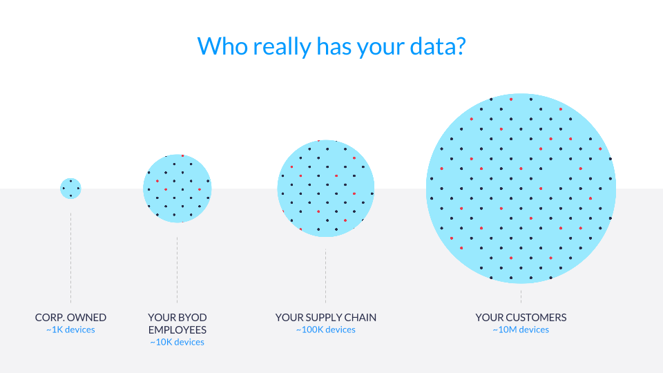
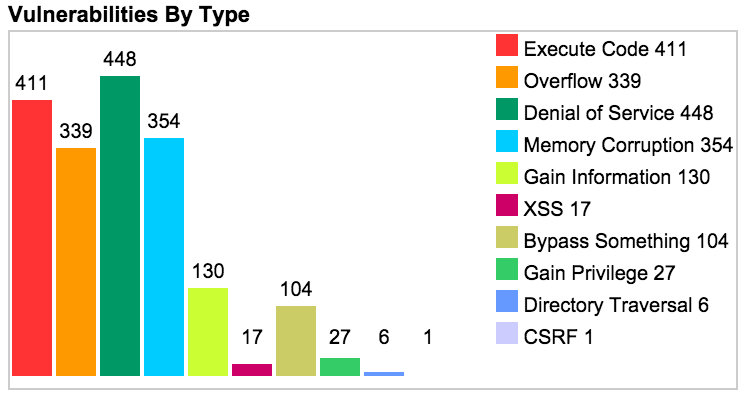
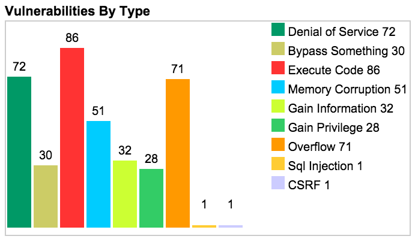
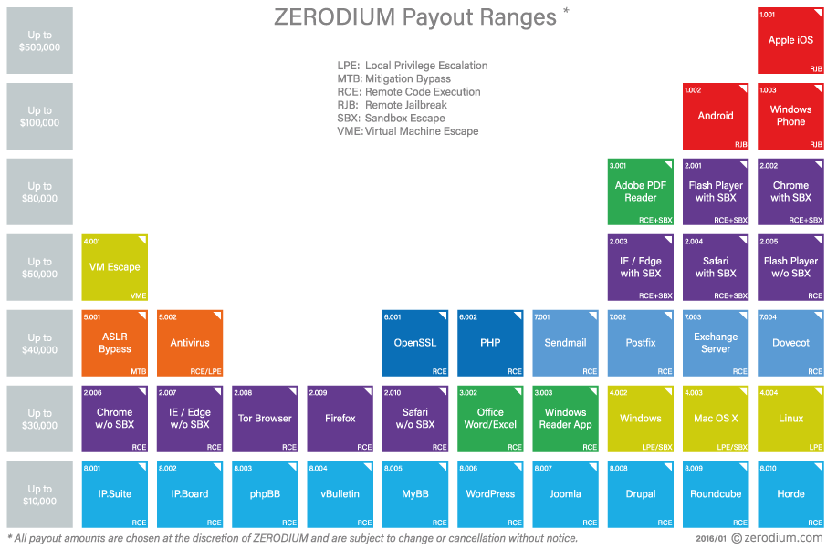

  <a class="cta-banner-pdf" href="https://info.nowsecure.com/IRforAndroidandiOS_PDFRequest.html">Read PDF<i class="fa fa-file-pdf-o"></i></a>
  <a class="cta-banner-update" href="https://info.nowsecure.com/IRforAndroidandiOS_Updates.html">Receive Updates<i class="fa fa-bell-o"></i></a>

# The case for mobile incident response
Use of mobile devices has sufficently penetrated enterprises to warrant including support for mobile in an incident response strategy. Mobile devices have access to sensitive data and impact the operations of an enterprise. And, like all technology, they have security flaws which expose the enterprise to risk.

While most enterprises have some form of incident response plan in place, very few have developed processes and tools to respond to a mobile incident. This is a clear gap that security teams must address.

In this section, we will demonstrate that mobile apps and devices:

* are the focus of government regulation and law enforcement
* possess significant security and privacy flaws
* are the target of cyber-criminal and nation state attacks
* receive very little security focus and investment from enterprises

## Regulation and law enforcement
In the previous section, we explored a few examples of regulations that cover incident response. However, smartphones are a relatively new technology and at best are addressed broadly in a few of these regulated industries. This means that the industry is largely self-regulated today and, unfortunately, mobile device and app security issues abound.

If these issues persist and become a larger problem, it will ultimately lead to regulation and law enforcement. This is something the mobile industry should strive to avoid by addressing these issues within the ecosystem. This can be achieved far more quickly and efficiently by the industry itself than by government regulation.

### FTC v. Wyndham
In 2008, Wyndham Worldwide Corporation experienced several security incidents resulting in the loss of credit card data. The impact of this data breach was over $10.6 million in fraud loss. The Federal Trade Commission (FTC) filed a complaint in federal court against Wyndham under Section 5 of the FTC Act for unfair methods of competition. 

Wyndham fought the FTC suit, but the district court judge ruled in favor of the FTC. Wyndham appealed the decision but in August 2015, the U.S. Court of Appeals for the Third Circuit affirmed the district court, upholding the FTC's data protection authority.  

Judge Thomas Ambro stated:

> A company does not act equitably when it publishes a privacy policy to attract customers who are concerned about data privacy, fails to make good on that promise by investing inadequate resources in cybersecurity, exposes its unsuspecting customers to substantial financial injury, and retains the profits of their business. [^1]

While this ruling does not directly involve mobile devices or apps, it is significant for several reasons:

1. Mobile apps are required to publish a privacy policy through multiple mechanisms including the terms of service for Apple's App Store and Google Play as well as various privacy laws including [California's Online Privacy Protection Act](http://leginfo.legislature.ca.gov/faces/codes_displayText.xhtml?lawCode=BPC&division=8.&title=&part=&chapter=22.&article=) and the European Union's [Data Protection Directive (95/46/EC)](http://eur-lex.europa.eu/LexUriServ/LexUriServ.do?uri=CELEX:31995L0046:en:HTML);
2. A compromise involving a mobile device or app would likely trigger the "investing inadequate resources in cybersecurity" unless the company performed security testing and had an incident response policy in place to minimize the impact of any breach.

The combination of the FTC v. Wyndham ruling plus a widespread lack of investment in mobile security does not bode well for enterprises benefiting from mobile devices and apps.

## Mobile devices and incident response trends
Over the past three decades, the process of incident response has matured. Bruce Schneier, a respected security technologist, wrote about evolution and the future of IR in his popular [Schneier on Security](https:/
/www.schneier.com/blog/archives/2014/11/the_future_of_i.html) [^2] blog. He identified broad focuses in each decade since the 1990s starting with protection, then moving into detection and finally focused on response by the 2010s.

He reflected that in recent years, new IR products and services are being developed and implemented due to three important trends:

1. Devices and data now regularly reside outside the control of IT departments (as a result of mobile, cloud computing, etc.)
2. Attacks and threats are far more sophisticated and effective
3. Companies continue to under-invest in protection and detection, increasing the need for response

Each of these trends are very much a reality in the mobile ecosystem and worth exploring further.

## Controling mobile devices and data
Mobile technology, by its very definition, lives outside the traditional definitions of IT boundries such as local networks and firewalls. This dramatically impacts the enterprise's ability to control both the devices and, perhaps more importantly, the data residing on them.  

### Device ownership and data storage
Increasing, the mobile devices which impact an enterprise's security are neither purchased nor managed by the IT department. Some quick examples of this include:

* Employees via the bring-your-own-device (BYOD) trend
* Contractors
* Vendors and supply chain
* Customers

While the recent trend in enterprise mobile security has been to deploy management software such as mobile device management (MDM), enterprise mobile management (EMM) and similar in BYOD scenarios, this is clearly a strategy that will not scale to an enterprise's vendors, supply chain and customers.

### Network perimeter
Clearly, mobile devices defy traditional network policy enforcement since they do not exclusively reside on the corporate network. By design, mobile devices likely have a least two and generally more ways they can connect to networks.

The obvious network connection not directly controlled by the enterprise is the mobile phone network. Today 4G networks are prevalent and fast and many individuals choose to use their mobile operator's network over corporate-provided Wi-Fi.

The next most common accessible networks are provided via Wi-Fi. This generally includes a network provided by the enterprise (and thus a controlled ingress/egress point where a company can exert oversight or control) but also includes home networks and various networks available to the public. These public networks include Wi-Fi access points provided by retail stores (e.g., Starbucks), airports, city-wide public networks, home-based Wi-Fi via companies (e.g., Comcast via their XFINITY service), and, unfortunately, malicious networks controlled by attackers.

While cellular and Wi-Fi networks are the most common paths to network access, there are additional techniques including:

* Bluetooth networks
* Tethering over USB
* Near field communication (NFC)
* GPS (a form of radio-based network traffic)

There are many ways mobile devices can connect to networks and very few of them provide enterprises with control over the traffic. While some IT departments and mobile security solutions attempt to backhaul mobile traffic over a device or per-app VPN, this technique will ultimately fail due to a number of causes discussed in the next section.

### Privacy implications
There is a growing backlash from device owners regarding mobile device management tools and techniques and their impact on privacy. In some instances, the legal teams at large enterprises are also pushing back against solutions which intercept or collect significant personal information as it becomes a liability. 

The biggest challenges are best examined by exploring the effects on a single technique. For this example, let's examine how a device or per-app VPN impacts a mobile device:

1. Initial setup is cumbersome
1. Re-connecting to the VPN is frustrating and time consuming
1. A VPN slows down many network connections, especially on a higher latency mobile network
1. Additional battery drain is incurred
1. Personal privacy is significantly impacted
1. Enterprises have access to sensitive employee data (e.g. Internet searches, app traffic and geo-location), which can place significant liability on the enterprise
1. These solutions are not possible to implement outside of devices used by employees and perhaps contractors (though the later is unlikely)

The trend in mobile devices and applications is clearly moving toward an ecosystem where IT and security departments have very little control over devices.

## Effectiveness of attacks and threats

As mobile devices and apps proliferate, cyber-criminals and actors focused on espionage (with both intellectual property and national security objectives) are clearly following the trend. They recognize that a significant amount of the data they target is now present and at times more accessible to them on mobile devices. 

While early mobile attacks were fairly trivial and frankly lazy, recent trends have revealed a more sophisticated and sustained effort to thwart mobile defenses. While we will explore this topic thoroughly in the [Attacking Mobile Devices](../mobile-attacks/README.md) chapter, it is helpful to provide several examples here.

### Mobile threats

Let's start off looking at mobile threats. This category includes vulnerabilities in mobile hardware, operating systems and apps that an attacker could exploit.

Educating enterprise decision makers about the risks of mobile threats and attacks is a critical first step to addressing the issues. However, mobile attacks are under-reported for several reasons:

1. Due to lack of visibility, many individuals and enterprises are not aware an attack has occurred
1. In server-side attacks, enterprises may be compelled to disclose the breach due to consumer protection laws, however, it is unlikely a targeted mobile attack would trigger such action

For these reasons, the most effective resources available today to educate individuals and enterprises about mobile risks are identifying the threats which could expose them to compromise.

#### Android security threats

Android encompasses a deeply intertwined ecosystem including Google/Android, original equipment manufacturers (OEMs), wireless carriers and app developers. In this brief overview, we will provide examples of several publicly known Android security threats.  

##### Andorid Stagefright vulnerability

In September 2015, Zimprium researcher Joshua Drake ([@jduck](https://twitter.com/jduck/)) disclosed a vulnerability impacting nearly all Android devices since Android version 1.5 and could allow an attacker to remotely execute code on the device. The flaw was discovered in the Stagefright library, a librady of shared code used by Android devices to process media files. By employing fuzzing techniques, it was discovered that specifically crafted media files including images, audio and video files sent to the device would crash libstagefright and provide the attacker with the ability to compromise the device.

Joshua coordinated with the Android Security team and patches were submitted to the Android Open Source Project (AOSP) and shared in advance with Android partners. However, the patches were not fully effective in mitigating the flaws and additional research uncovered new attack vectors. In addition, due to the complexity in deploying changes to the fragmented Android ecosystem, most users remain vulnerable to this day.

Note: if you own or manage risk for Android devices, you can determine if the device is vulnerable to Stagefright or other know flaws by running the Vulnerability Test Suite (VTS) for Android app. The app, developed by the NowSecure Research Team, is fully [open sourced](https://github.com/nowsecure/android-vts/) and actively maintained.

##### Samsung keyboard vulnerability

In June 2015, NowSecure researcher Ryan Welton ([@Fuzion24](https://twitter.com/Fuzion24)) presented at [BlackHat London](https://www.blackhat.com/ldn-15/summit.html#abusing-android-apps-and-gaining-remote-code-execution) [^4] and exposed a serious flaw in over [600 million Samsung devices](https://www.nowsecure.com/keyboard-vulnerability/). [^5] Despite following a responsible and coordinated disclosure process over the course of nine months, the flaw was ultimately misunderstood by Samsung and at the time of the disclosure, no patch existed that users or enterprises could apply. 

To make matters worse, the insecure application was signed with system privileges granting the app, and thus the attacker, significant access to the device and data through remote code execution. The app could not be disabled and regularly checked for updates over the network, the trigger necessary to launch the attack. Anyone with a position on the network between the endpoint and the SwiftKey update server could execute this attack.

#### App example

The Google Play store had 1.6 million apps available for download as of July 2015. [^10] Many of those apps contained security flaws, and so it's difficult to choose just one example. 

In January 2016, Jake VanDyke spent a week reviewing video cameras and the mobile apps that can remotely control them. After examining some of the most popular cameras on Amazon, Jake noted that "[every camera-and-app combination I tested included at least one security flaw](https://www.nowsecure.com/blog/2016/01/06/insecurity-cameras-and-mobile-apps-surveillance-or-exposure/)," and that concerned him. The various apps exhibited numerous flaws including:

* Sensitive data transmitted without encryption including username, password and location
* Unencrypted communications allowing someone to adjust camera settings, format the SD card, access stored photos and videos, and initiate the recording of audio or video
* Sending the WPA2 key for the network to which the camera was connected
* Vulnerabilities to man-in-the-middle (MITM) attacks

Hopefully it's clear from this single example that security flaws in mobile apps create significant exposure and risk for not only the individuals using the apps but also the enterprises they interact with and work for.

#### iOS security threats

Apple is incredibly effective in how they position and market the security of iOS devices. And there are indeed many excellent security features built into the platform. However, Apple developers are just as susceptible to creating security flaws as any other developer. 

A key difference between Apple's approach to security and Google's approach with Android is the availability of core Android source code (via the AOSP) for community inspection. This open approach has resulted in more flaws being identified and patched at the core of Android. However, when examining iOS code, security researchers have to employ different techniques, often requiring more time and effort. 

Based on Apple's effective marketing, and the lack of open source code available for inspection, many people in the IT industry believe that Apple is more secure. However, the the real answer is far more nuanced but can be quantitatively analyzed by examining publicly available vulnerability data.

##### Apple iOS CVEs

The Common Vulnerablilty and Exposure (CVE) system maintained by MITRE was designed to provide visibility into flaws exposed in IT systems. You can filter the data by vendor and operating system which provides visibility into the quantity and category of CVEs for Apple iOS and Android:

Figure 1: [iOS CVEs from 2007-2016](http://www.cvedetails.com/product/15556/Apple-Iphone-Os.html?vendor_id=49)

Figure 2: [Android CVEs from 2009-2016](http://www.cvedetails.com/product/19997/Google-Android.html?vendor_id=1224)

Clearly Apple developers fair no better than any other developer in writing secure code. And the closed nature of their system means far fewer eyes are available to inspect and find security flaws. If your strategy for mobile security is to simply rely on the Apple iOS platform, you need to explore additional layers of protection.

##### Apple's iOS 9 security updates

It is also revealing to examine Apple's own security page for the flaws they patch in each new iOS version. I applaud Apple and other technology companies for their transparency in posting these updates, but it seems to contrast with the perception of the security of iOS.

In particular, in the initial iOS 9 release, [Apple patched over 70 security flaws](https://support.apple.com/en-us/HT205212), many of them quite serious. There is also a history of Apple releasing a follow-up update very quickly after a major release to patch serious security flaws found by researchers in the new update. For example, Apple has had over 10 PIN-bypass flaws over the years, a vivid example that many users quickly understand. The ability for an attacker to circumvent the lock screen on iOS devices broadly exposes the device and data to compromise and exfiltration.

##### iPhone 4 hardware flaw

While most identified flaws occur in software (both the operating system and mobile apps), at times flaws are identified in the hardware of a device. This issues are extremely dangerous as there are generally no mitigations against these types of flaws. 

It has been quite some time since a flaw like this was found in an iPhone, however, it is worth pointing out an instance of this from the past. When Apple manufactured the iPhone 4, there was a flaw in the boot process that allowed an attacker to boot an unverified boot disk. This allowed any attacker with physical access to boot the device into a modified version of iOS that disabled the pass-code and allowed full access to the operating system and the data on the device.

This flaw was fixed in the next release of the iPhone, but anyone using that device was at risk and had very few, if any, mitigation actions  they could take.

Considering the history of CVEs in iOS, the sheer amount of new code that goes into each release, and the ever increasing complexity of the device and operating system, iOS will continue to have security flaws which, if exploited, place the individual and enterprise at risk.

##### iOS app security

Similar to Android, a significant part of the iOS ecosystem is the mobile apps available from the App Store (1.5 million apps as of July 2015)[^10]. Interestingly, iOS apps tend to be less secure than Android apps based on a high-level security scan of 100 popular apps. Such a small sample size prevents me from extrapolating this to the entire ecosystem, but it is certainly true for the popular apps tested.

One theory is that iOS app developers place more trust in the smart phone's operating system than Android developers do. However, while iOS provides many strong security features, it cannot prevent developers from making common mistakes like sending or storing sensitive data without encryption, failing to adequately perform certificate checking, or ignoring other common [mobile app security best practices](https://www.nowsecure.com/resources/secure-mobile-development/). 

### Mobile attacks

Unlike mobile threats, mobile attacks identify actual instances of mobile threats being exploited in the wild. While these examples are less frequent, they make the strongest case for enterprises to invest in mobile security and incident response. These attacks fall broadly into these categories:

* Known malware
* Targeted attacks
* Weaponizations of mobile threats 

In the [Case Studies](../case-studies/README.md) chapter we will provide deeper examination of real world mobile attacks. However, it is useful to provide examples of several known mobile attacks.

#### Mobile Malware

Mobile malware is the most common form of mobile attack, in particular because they are far easier to identify by examining mobile apps. While all mobile attacks are undesirable, mobile malware is the most benign of the categories listed above. We will provide an example of malware on both iOS and Android.

##### Apple iOS XCodeGhost attack

In late 2015, researchers from Palo Alto Networks uncovered modified versions of XCode, the development environment for iOS, available on multiple websites in China. XCode is a large download and developers in China would often choose cached versions of XCode hosted in China to decrease download times.

Attackers seized this opportunity and modified XCode so that when developers compiled and ultimately deployed thier applications to the App Store, malicious code was automatically included in the applications. The malicious code would exfiltrate private data from the iOS devices upon which the app was installed and run.

Apple identified the affected apps and immediately removed them from the App Store. They published a list of affected apps on their website and worked closely with those apps' developers to ensure new versions were pushed to the App Store quickly. Some of the apps are extremely popular and the full impact of the attack is likely not yet understood.

##### Android SimpleLocker malware

The Android ecosystem has been a larger target of mobile malware than any other smart phone to date. As such, choosing a single example malware to discuss is difficult. In our Mobile IR Case Studies section, we will explore the outbreak of a [malicious app targeting customers of Aetna, an insurance provider](../case-studies/mobile-malware-discovered.html), and how the incident was handled. For this overview, though, we will discuss a piece of malware that falls into the "ransomware" category.

In June 2014, a number of security companies ([Sophos](https://nakedsecurity.sophos.com/2014/06/06/cryptolocker-wannabe-simplelocker-android/) | [Blue Coat](https://www.bluecoat.com/security-blog/2014-06-06/simplelocker-android-ransomware-encrypts-files)) began reporting on and analyzing a newly discovered instance of malware dubbed SimpleLocker.

The initial attack vector appeared to be fake porn sites that prompted the user to download and install a video player.[^9] After installation, the app launched and immediately took over the screen. It then presented a threatening message demanding payment to decrypt the user's files. The back button was disabled, and if the user hit the "home" button, the app rapidly re-launched. During this time, the app encrypted images (PNG, JPEG) and plain text files (TXT) within the device's media storage. It also leveraged the TOR network for its command-and-control (C2) traffic.

We will study this malware more closely in the Lab Exercises included in this book.  

#### Weaponizing mobile threats

While security problems in mobile apps and operating systems, as well as malicious apps are grounds for concern, a more nefarious threat exists. It is generally accepted that it is nearly impossible to prevent a targeted attack against an individual or organization. As such, any evidence of a malicious actor enabling or performing targeted attacks is a area of great concern.

##### Zerodium's one million dollar iOS 9 bug bounty
Zerodium is a privately held, venture-backed company that positions itself as "the premium acquisition program for zero-day exploits and advanced cybersecurity research."[^11] On September 15, 2015 they announced a $1 million bug bounty for iOS. The bounty would be paid out for any individual or team that "creates and *submits to ZERODIUM an exclusive, browser-based, and untethered jailbreak for the latest Apple iOS 9* operating system and devices"[^12]. While this alone should cause significant concern given the size of the bug bounty and the specific criteria, what's truly disturbing is that on November 1, 2015 Zerodium acknowledged that one team had won the prize.[^11].

Of course, the natural question is what does Zerodium then do with the zero-day? According to their FAQ, they:
> analyze and document the vuln, and provide that documentation along with protective measures and security recommendations to clients as part of their Security Research Feed[^13]

Zerodium also answers the next logical question of who their clients are: "ZERODIUM customers are major corporations in defense, technology, and finance, in need of advanced zero-day protection, as well as government organizations in need of specific and tailored cybersecurity capabilities."

Of particular concern is the reference to government organizations and tailored cybersecurity capabilities, which likely means targeted attacks. While it would be naive to assume government agencies are not involved in such activities, the risk organizations of major corporations should take note of Zerodium's public acknowledgment of this capability.

Finally, it's quite telling to see the pay-out ranges for different types of exploits and systems. In particular, mobile devices are positioned in the highest pay-out category.

Figure 3: Zerodium Payout Ranges[^14]

##### Hacking Team 
While Zerodium is in the business of buying and then re-selling exploits, we do not have a clear view into their internal operations nor their customers. However, in July 2015 the compromise of Italian firm Hacking Team exposed not only the internal operations of a company weaponizing and selling exploits but also their customer list. That list included sovereign nations with documented human rights violations against reporters and activists. Until the time of the compromise, Hacking Team adamently denied they sold their software to any countries with documented human rights violations. However, the compromise and exposure of 400GB of [Hacking Team emails](https://wikileaks.org/hackingteam/emails/) and files revealed that Hacking Team was in fact [weaponizing mobile security flaws](https://wikileaks.org/hackingteam/emails/emailid/1028689) and selling them to governments around the world. 

We explore the [Hacking Team case study](../case-studies/hacking-team-analysis.html) in more detail later, but a key takeaway for security professionals is that attackers see value in targeting mobile devices and are capable of compromising them. In addition, there are companies out there whose whose business model is based on selling "offensive intrusion and surveillance capabilities to governments, law enforcement agencies and corporations." [^8] 

## Under-investing in security
In the final incident response trend pointed out by Bruce Schneier, companies are clearly under-investing in mobile security, which greatly increases the need for effective incident response.

In an IBM sponsored study in 2015, the Ponemon Institue found that:
> Among the more than 400 organizations studied — nearly 40 percent of which were Fortune 500 companies — almost 40 percent of them aren’t scanning the code in their apps for security vulnerabilities, leaving the door wide open to the potential hacking of sensitive user, corporate and customer data. The average organization tests fewer than half of the mobile apps it builds, and a whopping 33 percent of companies never test their apps. [^7]

Instead of taking a survey, NowSecure released their [2016 Mobile App Security Study](https://www.nowsecure.com/blog/2016/02/11/2016-nowsecure-mobile-security-report-now-available/), which performed aggregated analysis of more than 140 million mobile security data points collected each day by the NowSecure Intelligence engine and evaluated 400,000 Android apps available on the Google Play store. Key findings from the study include:

* 24.7 percent of mobile apps include at least one high risk security flaw
* The average device connects to 160 unique IP addresses every day
* 35 percent of communications sent by mobile devices are unencrypted
* Business apps are three times more likely to leak login credentials than the average app
* Games are one-and-a-half times more likely to include a high risk vulnerability than the average app

# The case for mobile incident response
The objective of this section was to outline the need for mobile incident response. Mobile devices have deeply permeated all facets of the enterprise and exhibit unique characteristics that necessitate a strong incident response capability. These characteristics include:

* Government regulatory and law enforcement bodies are beginning to require and enforce mobile security
* Mobile devices and data are increasingly outside the control of IT
* Cyber-criminals and nation states are targeting mobile devices
* Mobile apps and devices harbor a large number of security and privacy flaws
* Enterprises continue to under-invest in mobile security

#### Footnotes
[^1]: http://www2.ca3.uscourts.gov/opinarch/143514p.pdf
[^2]: The Future of Incident Response - Schneier on Security. Web. Wed Oct 21 2015. <https://www.schneier.com/blog/archives/2014/11/the_future_of_i.html>.
[^4]: Black Hat London 2015 | Summit. Web. Wed Oct 21 2015. <https://www.blackhat.com/ldn-15/summit.html#abusing-android-apps-and-gaining-remote-code-execution>.
[^5]: NowSecure. Samsung Keyboard Security Risk Disclosed: Over 600M+ Devices Worldwide Impacted  | NowSecure. Web. Wed Oct 21 2015. <https://www.nowsecure.com/keyboard-vulnerability/>.
[^7]: https://securityintelligence.com/mobile-insecurity/
[^8]: https://en.wikipedia.org/wiki/Hacking_Team
[^9]: http://securitywatch.pcmag.com/mobile-security/324666-mobile-threat-monday-android-ransomware-encrypts-your-files-don-t-pay-up
[^10]: http://www.statista.com/statistics/276623/number-of-apps-available-in-leading-app-stores/
[^11]: https://www.zerodium.com/
[^12]: https://www.zerodium.com/ios9.html
[^13]: https://www.zerodium.com/faq.html
[^14]: https://www.zerodium.com/program.html
