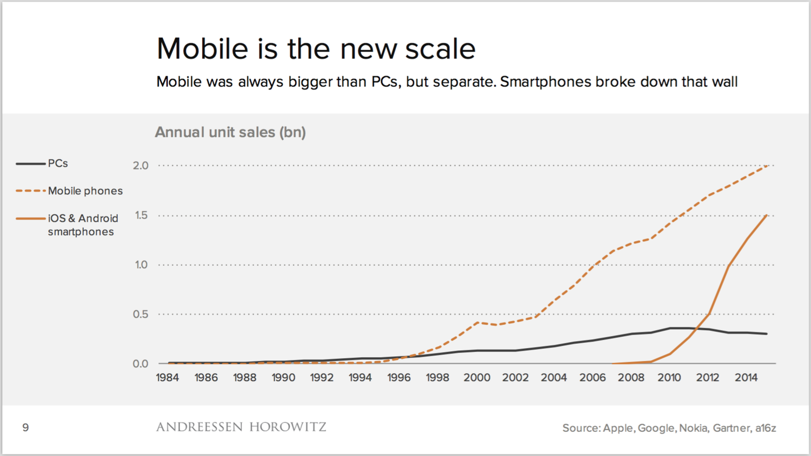

# Differences between Computer and Mobile Incident Response

In general, an incident response framework should not need to change to address new technologies. However, the unique properties of mobile devices and operating systems do present certain challenges when responding to a mobile incident.

Mobile incident response differs from traditional network- or computer-based incident response for a number of reasons: 

* Mobile devices are built for individual consumers
* Mobile’s explosive growth
* Mobile devices are always powered on and connected
* A broad attack surface
* A lack of administrative access to mobile devices
* The implementation of app sandboxes
* App store models

## Mobile devices are built for individual consumers

Manufacturers build mobile devices primarily for individual consumers, unlike computers and servers. Because managing a large number of devices doesn’t usually concern the majority of individual consumers, most devices do not include important IT and security management functions. Without some of these basic management capabilities, a lot of data incident responders might count on in a computer-based incident is not available to them after a mobile incident. This fact underscores the importance of conducting a mobile threat assessment so that you can baseline mobile devices that connect to corporate assets and identify anomalies.

## Explosive Growth
In 2014, analyst Benedict Evans gave a presentation entitled, “Mobile is eating the world.” Below is a slide from that presentation showing that the smartphone industry now dwarfs the computer industry.

`
Figure 1: [Mobile, ecosystems and the death of PCs](http://ben-evans.com/benedictevans/2015/11/7/mobile-ecosystems-and-the-death-of-pcs)

Such explosive growth left the security industry behind, trying to pick up the pieces. The industry didn't have time to mature, and this failure to keep pace was amplified by a completely new architecture and limitations created by operating systems’ sandboxes. In addition, a traditional approach to endpoint security (i.e., focused on malware) is less effective when applied to the mobile ecosystem. Mobile security failing to progress at the same speed as mobile use grows results in a lack of visibility into mobile risk, how to manage it, and how to detect a mobile incident.

## Always powered-on and connected
Unlike laptops and desktops, mobile devices are almost always connected to the Internet. According to [a commissioned study](http://www.marketingcharts.com/online/smartphone-addiction-7-in-10-keep-them-close-at-all-times-34956/) conducted by Harris Interactive, 72 percent of mobile users are within five feet of their devices most of the time. Mobile devices also connect to cellular networks, Wi-Fi networks, and other technologies such as Bluetooth automatically. As documented in the [2016 NowSecure Mobile Security Report](https://info.nowsecure.com/rs/201-XEW-873/images/2016-NowSecure-mobile-security-report.pdf), we find that the average mobile device connects to 160 IP addresses located all over the world each day, and 35 percent of the data transmitted via those connections is unencrypted. Half of mobile devices in the U.S. connect to insecure Wi-Fi networks each day.

This adds up to a whole lot of mobile risk, and a whole lot of avenues that an incident responder may need to explore in responding to a mobile incident.

## Broad attack surface
The mobile ecosystem also presents a broad attack surface resulting from a wide user base, rapid development, and continuous connectivity. Mobile attacks can occur at the device layer, the network layer, the data center, or a combination of these.

Below we’ve provided a non-exhaustive list of areas of exposure within mobile and possible attacks sorted by device, network and data center. The list was originally published in NowSecure’s collection of [Secure Mobile Development Best Practices](https://www.nowsecure.com/resources/secure-mobile-development/), and the information below is a condensed overview. We will take a closer look at details later in the book. 

* Device layer
    * Browser, mail, or other preloaded applications
        * Phishing
        * Framing - delivery of a Web/WAP site in an iFrame
        * Clickjacking
        * Drive-by downloading
        * Man-in-the-mobile (MitMo)
    * Phone/SMS
        * Baseband attacks
        * SMiShing 
        * Radio frequency (RF) attacks (e.g., baseband, Bluetooth and other channels
    * Third-party apps
        * Insecure storage of sensitive data
        * No Encryption/weak encryption
        * Improper SSL validation
        * Configuration manipulation
        * Dynamic runtime injection
        * Unintended permissions
        *Escalated privileges
    * Operating system
        * No passcode
        * iOS jailbreaking
        * Android rooting
        * Passwords and data accessible
        * Carrier-loaded software
        * Zero-day exploits
* Network layer
    * Wi-Fi (weak encryption/no encryption)
    * Rogue access points
    * Packet sniffing
    * Man-in-the-middle (MITM)
    * SSL strip attacks
    * Session hijacking
    * DNS poisoning 
    * Fake SSL certificates
* Data center layer
    * Web server
        * Platform (i.e., operating system, server software, or application modules) vulnerabilities
rerver misconfiguration
        * Cross-site scripting (XSS)
        * Cross-site request forgery (CSRF)
        * Weak input validation
        * Brute-force attacks
* Database
    * SQL injection
    * OS command execution
    * Privilege escalation

## Lack of administrative access
Neither individuals nor enterprises typically have administrative (or “root”) access to their devices or the devices connecting to corporate assets. This makes it more difficult to monitor the security of a device, develop effective tools to repel attacks, and conduct thorough security testing of mobile apps.

Operating system (OS) developers, original equipment manufacturers (OEMs), and wireless carriers, however, can gain system or root access via their pre-installed apps. Unfortunately, attackers can exploit that administrative access via vulnerabilities in many pre-installed mobile apps. Developers, OEMs, and carriers are slow to patch such vulnerabilities (for myriad reasons), leaving individuals and enterprises exposed and powerless to do anything about it.

A lack of visibility into the lower-level operations of these devices and apps results in a lack of awareness of how an enormous amount of data is handled, and it’s often handled insecurely. Worse yet, the individuals most affected by this lack lack of security, and the enterprises they interact with via mobile as employees or customers, are left in the dark. Such a wide variety of operating systems, devices and apps means mobile incident responders must understand a lot of different data from a lot of different sources in order to find and assemble the pieces of a mobile incident.

## Application sandbox implementations
An application sandbox creates a boundary of sorts around an app and limits the files and resources any particular app can access. Sandboxing provides some security benefit because it restricts the privileges of an app, which protects users from unintentional bugs and makes it more difficult for malware to compromise a device.

Unfortunately, installable security apps that might provide additional security and monitoring features are also limited by the sandbox and cannot truly protect the device due to restrictions. These restrictions hamper the effectiveness of traditional computer-based approaches to endpoint security such as the following:

* Anti-virus or anti-malware software
* Data loss prevention (DLP) software
* Host-based firewalls

## App store model
Years ago, applications were installed using CD-ROMs and floppy disks. Today we take for granted the ease with which apps can be installed thanks to the app store model. The model has also significantly reduced the barrier-to-entry for app developers. In many cases, almost anyone can develop and distribute an app. This might include large companies with a mature development model that takes security and quality assurance (QA) into account (though plenty of them still don’t). It also includes individuals (some amateur, some not) and smaller companies intent on developing the next “killer app.” Unfortunately, it also includes malicious parties that can use an app store as an incredibly effective delivery engine.

It’s never been easier to install an application on a computing device. In an aggregated analysis of data from users of our NowSecure Protect mobile security assessment app, as of November 2015 we found that the average device has 300 apps installed on it. Users can’t uninstall many of those apps, though they can disable some of them. The problem is many of those apps include security and privacy flaws. In an analysis of more than 400,000 apps available on the Google Play app store, we found that 49 percent of them include at least one high-risk security flaw.

## Mobile is different
Each of the items explained in this section add up to significant differences between mobile and traditional security and incident response. The rest of this book will help prepare you and explain the tools you’ll need to address these challenges in responding to a mobile incident.
