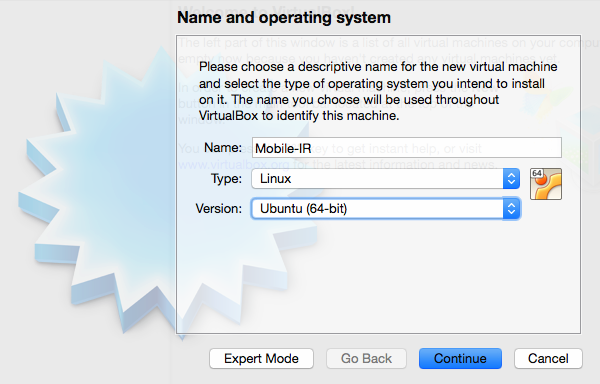
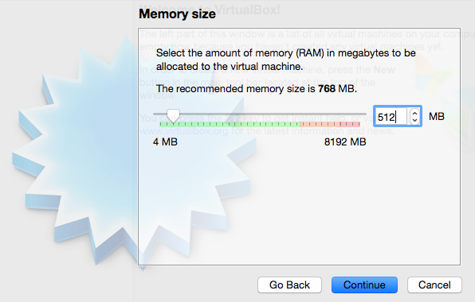
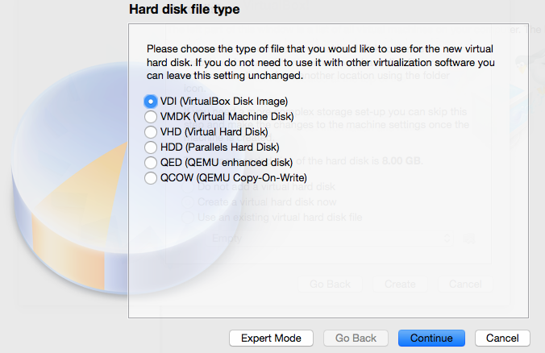
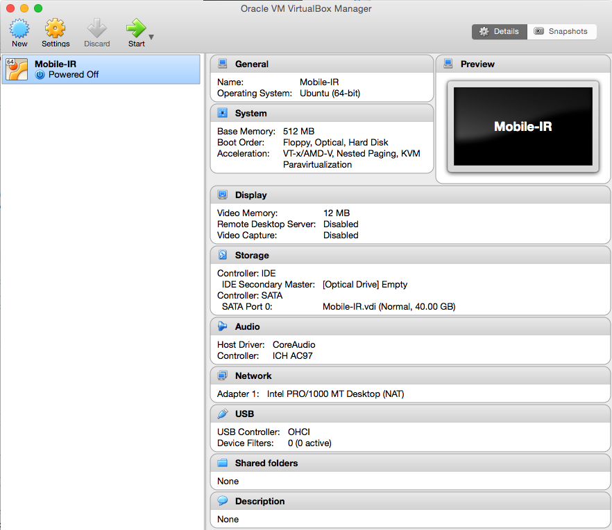

  <a class="cta-banner-pdf" href="https://info.nowsecure.com/IRforAndroidandiOS_PDFRequest.html">Read PDF<i class="fa fa-file-pdf-o"></i></a>
  <a class="cta-banner-update" href="https://info.nowsecure.com/IRforAndroidandiOS_Updates.html">Receive Updates<i class="fa fa-bell-o"></i></a>

# How to Setup a Mobile Incident Response Workstation

Preparation is a key component to responding to any type of incident. Part of that step involves setting up an environment which contains all of the tools a mobile responder might need to properly respond to a situation. This chapter will provide you with the necessary tools to provide mobile incident response at your organization. We will focus on free and/or open source software. In addition, later chapters will provide labs you can perform on your workstation with detailed HOWTO walk-throughs.

In order to install and run the tools needed to respond to a mobile incident, it is easiest to simply setup a Linux virtual machine which already has everything pre-installed and ready for use. Santoku is a Linux distribution that contains a collection of tools related to mobile security, malware, and forensics and will be used in the various exercises and labs throughout this book.  

On the mobile security side, app decompilation and disassembly tools are provided, along with scripts to automate decrypting binaries, deploying apps, and enumerating app details in order to detect common issues in mobile applications. Mobile device emulators are also provided along with utilities to simulate network services for dynamic analysis, which can be useful for both analysis of mobile malware and standard mobile apps. Finally, there are forensic tools available to help acquire and analyze data that resides on a mobile device. These include firmware flashing, forensic imaging, and other scripts that are specifically designed for mobile forensics. Later in this chapter, we provide a detailed list of free, open-source, and commercial tools that can be used.

## What you will need
* Santoku Linux .ISO file (Note: Santoku Linux versions 0.4 and later are 64-bit and require 64-bit hardware to run)
* Virtual Box or VMWare Player
* A host machine with a minimum dual-core processor, 2GB RAM, and 40 GB free hard drive space or larger recommended

## Download Santoku
Santoku is distributed as a .iso file. If you would like to install Santoku as the primary OS on your host machine, you will need to create a bootable DVD or USB using the .iso file.

The recommended method of running Santoku is by installing it as a virtual machine (VM) inside either VirtualBox or VMWare player, which are applications that allow you to create and run VMs inside your native OS. This tutorial highlights how to install VirtualBox, however either should work for your needs. Virtualbox supports all major operating systems, including Microsoft Windows, Apple OS X and Linux.

To acquire Santoku, you must first download the .iso file at https://www.santoku-linux.com/download

## Set up your virtual machine
To run Santoku, you must install virtual machine software. For this section we will use the most recent version of VirtualBox, version 5.0.14. It can be downloaded at: http://www.virtualbox.org/wiki/Downloads

After downloading, install the virtual machine software on your forensic workstation, then follow the next steps to start the virtual machine (VM):

Locate your VirtualBox installation. Select “New” to create a new VM.
Going through the wizard, create a name for your VM and select the Linux/Debian Operating System and Version. Note: For Santoku Linux 0.4 and newer, select “Ubuntu 64-bit”. 

Select an appropriate amount of memory for the VM. 512MB is standard, however increasing the memory size will typically make your VM run faster (but your host machine slower). If you’re going to use the Android Virtual Device Manager (AVD) and Android device Emulator frequently, we recommend selecting at least 4 GB of memory.

At the “Hard Disk” screen, select “Create a virtual hard disk now”. To create a new hard disk, select the “VDI (VirtualBox Disk Image)” option.

On the next screen, select “Dynamically allocated” and click ‘Continue’.

Choose the Virtual disk location to store the virtual hard disk by clicking the folder icon on the right, then click the “Save” button. Adjust the ‘Size’ slider to allocate however much space you would like for your Santoku hard drive. Depending on your use, you may want to set this to a smaller or a larger value. The default in VirtualBox is 8 GB, we recommend increasing this to 40GB, as show below. When finished, click “Create”. This will bring you back to the main VirtualBox menu.

To get your Santoku-Linux to run on the VirtualBox, you need to have it attached it to your newly created Virtual Machine. This is the same as putting in a CD or DVD to boot from the first time you are installing a new OS. To do this, select the Santoku-Linux VM that you just created and click the “Settings” button at the top of the screen. Select the “Storage” option on the left of the Settings screen, and then click the cd icon next to the “IDE Controller” as shown below.

A warning will pop up asking you to choose a virtual DVD. Select “Choose disk” and navigate to your recently downloaded Santoku .iso file (in this case, it’s in the home user’s /Downloads/Santoku file). Click “Open”, then “OK”.

## Install Santoku
You can now click “Start” on the main VirtualBox screen to load the VM. Select to either boot from the live DVD or install. If you have created this in a Virtual Machine, choose “install – start the installer directly”.

Choose your language, time zone, and clock settings, then select “Erase disk and install Santoku” on the ‘Installation type’ screen. WARNING: If you choose this option and you are not installing Santoku in a Virtual Machine (i.e., you are not using VirtualBox and instead are installing it directly to your hard drive) this will ERASE YOUR HARD DRIVE. You have been warned. From there, add your username and password and click ‘Install’.

After the installation is complete, reboot when prompted, then login using the username and password you created during the install process.

## Install Guest Editions (VirtualBox)
Once logged in, initiate the process to install VirtualBox Guest Additions by going to Devices -> Install Guest Additions. This is a one-time setup, and will allow for improved graphic performance, shared folders, and other features within the VM. You will see the Guest Additions icon appear on the Desktop. Right click it and select “Mount Volume”.

Next, open a Terminal window located under Applications > Accessories > Terminal (we have also created a shortcut to the Terminal window on the top status bar of the VM). Once open, navigate to the VBOSADDITIONS directory which was mounted in the previous step, and execute the install script by running the following commands (do NOT type the “$”. This is intended to signify the beginning of a command prompt. Also, in this case it is VBOXADDITIONS_4.1.8_75467. The numbers following VBOXADDITIONS may vary):

$ cd /media/VBOXADDITIONS_4.1.8_75467/
$ sudo sh VBoxLinuxAdditions.run

You may need to enter the administrator password, which you set up during install. Finally, the VM may need to be restarted for the changes to take effect.

Update your local package index with the latest changes made in repositories by typing the following: sudo apt-get update. After that completes, upgrade the packages by typing the following: sudo apt-get upgrade. These might ask if you want to continue (giving a Y/n option), type “Y” and hit enter.

## Getting Started with Santoku
Now that your VM is up and running, you’ll want to connect a mobile device to it and start having some fun. To connect a mobile device to your VM, go to the VirtualBox menu, click Devices –> USB Devices –> <Your Device>. Make sure the checkmark is checked next to your device and it will be passed through to your Santoku VM.

Connect USB in VirtualBox
Now that you’re up and running, head over to the Santoku HOWTO’s section to read up on your favourite tools and learn about some new ones. In Chapters 7 and 8, we will provide additional exercises and Labs that will demonstrate how these tools can be used in practice.
